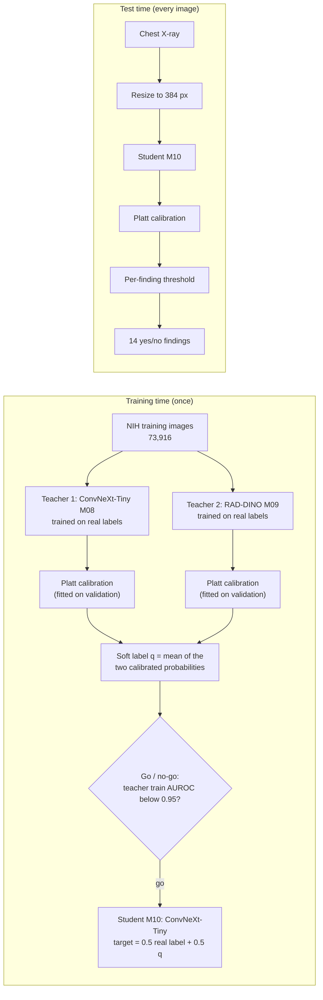

# Methodology: distilling RAD-DINO into a ConvNeXt-Tiny for chest X-ray classification

**Final model: M10, a ConvNeXt-Tiny trained on the soft predictions of the CNN + RAD-DINO average (knowledge distillation).**

This document describes every mechanism used to build, train, calibrate and evaluate the final model, and the earlier cascade study that led to it. All numbers come from the files in this repository; results are reported in [RESULTS.md](RESULTS.md). Rules for each experiment were fixed in advance in [evaluation_protocol.yaml](evaluation_protocol.yaml) (v2.0.0 cascade, v2.2.0 distillation). References are numbered in square brackets and listed in Section 12.

---

## 1. Overview

The goal is RAD-DINO-level accuracy at the cost of a small CNN. Two trained models act as **teachers**: a ConvNeXt-Tiny CNN (M08) and the X-ray-pretrained transformer RAD-DINO (M09). Their calibrated average labels the training images with soft probabilities, and a new ConvNeXt-Tiny (M10, the **student**) learns from these soft labels together with the real labels [11], [12]. At test time only the student runs.

Why distillation and not a cascade is explained in Section 6.

---

## 2. Task and data

**Task.** Multi-label classification: for each frontal chest X-ray, decide independently for each of 14 findings whether it is present. Label order: Atelectasis, Cardiomegaly, Effusion, Infiltration, Mass, Nodule, Pneumonia, Pneumothorax, Consolidation, Edema, Emphysema, Fibrosis, Pleural thickening, Hernia. "No Finding" is not a label; such an image is an all-zero vector. 30% of test images carry two or more findings, so the task is truly multi-label.

**Dataset.** NIH ChestX-ray14 [1]: 112,120 frontal X-rays from 30,805 patients (Kaggle `nih-chest-xrays/data`). Labels were extracted from radiology reports by text mining, not read from the images, and are known to be noisy [2].

**Split (`NIH_OFFICIAL_PV`).**

| Partition | Images | Patients | How it is formed |
|---|---:|---:|---|
| Train | 73,916 | 23,806 | Official `train_val_list.txt`, minus validation |
| Validation | 12,608 | 4,202 | Random 15% of the train_val **patients** (scikit-learn `GroupShuffleSplit` [3], seed 42) |
| Test | 25,596 | 2,797 | Official `test_list.txt`, unchanged |

- No patient appears in more than one partition.
- The split is fixed by hashes: SHA-256 of both official list files, and of the split file (`b9f2fbc9…`). Every notebook refuses to run if they differ.
- **Known shift:** the official test set is sicker than train/validation (1.06 vs 0.61 findings per image, 9.2 vs 3.0 images per patient, 43% vs 66% PA views). This matters for any method whose behaviour depends on the data mix (Section 6).

---

## 3. Image preprocessing and augmentation

| Step | Setting |
|---|---|
| Reading | Grayscale PNG → values in [0, 1] |
| Resize | Bilinear (torchvision [4]); 384 × 384 for the CNNs, 518 × 518 for RAD-DINO |
| Channels | Grayscale replicated to 3 channels (both backbones expect RGB) |
| Normalisation | CNNs: ImageNet mean/std [5]; RAD-DINO: mean 0.5307, std 0.2583 (its own pretraining statistics [6]) |
| Training augmentation | Random resized crop (scale 0.85–1.0, aspect 0.9–1.1), horizontal flip (p = 0.5), rotation ±7° (p = 0.5), brightness/contrast jitter 0.1 |
| Validation / test / soft-label pass | Resize and normalise only (no augmentation) |
| Test-time augmentation | None |

---

## 4. Teacher models

### 4.1 Teacher 1: ConvNeXt-Tiny (M08)

| Part | Setting |
|---|---|
| Backbone | ConvNeXt-Tiny [7], `convnext_tiny.fb_in22k_ft_in1k` from timm [8] (pretrained on ImageNet-22k, fine-tuned on ImageNet-1k [5]); full fine-tuning |
| Head | Global average pooling → dropout 0.2 → linear 768 → 14 |
| Regularisation | Stochastic depth (drop path) 0.1 [9], weight decay 0.05 |
| Schedule | 1 warm-up epoch training the head only (LR 1e-3), then up to 8 fine-tuning epochs, head and backbone at LR 1e-4 |
| Batch size | 32 |
| Size | 27.8 M parameters |

### 4.2 Teacher 2: RAD-DINO (M09)

| Part | Setting |
|---|---|
| Backbone | RAD-DINO [6], a ViT-B/14 [10] trained on chest X-rays with the DINOv2 self-supervised recipe [13] (`microsoft/rad-dino`, revision `110cbc18…`) |
| Input | 518 × 518 px = 37 × 37 = 1,369 patches of 14 px |
| Pooling | CLS token concatenated with the mean of the patch tokens (1,536-d) |
| Head | Dropout 0.2 → linear 1,536 → 14 |
| Fine-tuning | Last 8 of 12 transformer blocks + final layer norm trained; layer-wise learning-rate decay 0.8 (lower blocks learn more slowly) [14] |
| Schedule | 2 warm-up epochs (head only, LR 1e-3), then up to 4 fine-tuning epochs (head 2e-4, backbone 2e-5) |
| Weight averaging | Exponential moving average of the weights, decay 0.999 [15]; the averaged weights are the ones evaluated |
| Batch size | 12 |
| Size | 86.6 M parameters |

### 4.3 Training mechanism shared by all three networks (M08, M09, M10)

**Loss: Asymmetric Loss (ASL)** [16]. Findings are rare (0.3%–24% prevalence), so most labels are negatives, and most of those are easy. ASL down-weights easy negatives more strongly than positives. For logit $z$, probability $p = \sigma(z)$, target $y \in [0, 1]$ and margin $m$:

$$
\mathcal{L}(z, y) = -\Big[\, y \,\log(p)\,(1-p)^{\gamma_+} \;+\; (1-y)\,\log(1-p_m)\,p_m^{\gamma_-} \Big], \qquad p_m = \max(p - m,\, 0)
$$

with $\gamma_+ = 1$, $\gamma_- = 4$, $m = 0.05$. The loss is summed over the 14 findings and averaged over the batch.

| Part | Setting |
|---|---|
| Optimiser | AdamW [17], weight decay 0.05 |
| Learning-rate schedule | Per phase: 3% linear warm-up, then cosine decay [18] |
| Gradient clipping | Global norm 1.0 |
| Precision | fp16 mixed precision [19] on a Tesla T4 |
| Early stopping | Validation macro AUROC (on raw logits, real labels); patience 2 fine-tuning epochs; the earlier epoch wins ties; the best checkpoint is kept |
| Determinism | cuDNN deterministic mode, seeded data-loader workers, `CUBLAS_WORKSPACE_CONFIG=:4096:8`; one training seed (42) |

Software: PyTorch 2.10 [20], timm 1.0.26 [8], Hugging Face Transformers 5.0 [21].

---

## 5. From scores to decisions

These steps are applied the same way to every system (CNN, RAD-DINO, their average, and the final model). All of them are **fitted on validation only**.

### 5.1 Calibration (Platt scaling)

Network outputs are turned into probabilities with per-finding Platt scaling [22]:

$$
\hat p_c = \sigma(a_c\, z_c + b_c)
$$

where $z_c$ is the logit for finding $c$. The two numbers $a_c, b_c$ are fitted on validation by minimising the binary negative log-likelihood (L-BFGS-B, $a_c \in [10^{-3}, 100]$, $b_c \in [-50, 50]$). Calibrated probabilities are needed for two reasons: the teacher average (Section 7.2) must combine two models on the same scale [23], and a probability of 0.15 should mean "about 15% of such images have the finding". Calibration quality is reported as expected calibration error (ECE, 15 bins) [24].

### 5.2 Decision thresholds

Each finding gets its own yes/no threshold: the value that **maximises F1 on validation** [25]. Candidates are the unique validation scores; ties go to the smallest threshold; a finding whose best F1 is 0 would get 0.5 and be flagged (none were). Because findings are rare, these thresholds are low (0.04–0.25 for the final model).

### 5.3 Average of both teachers

$$
p^{\text{avg}}_c = \tfrac{1}{2}\,\big(\hat p^{\text{CNN}}_c + \hat p^{\text{RAD-DINO}}_c\big)
$$

This equal-weight average is both a reference system (the most accurate one, at 1.18× RAD-DINO's cost) and the teacher of the final model.

---

## 6. The route that failed: a two-stage cascade

The first design was a confidence cascade [26], [27]: the CNN reads every image, and only "hard" images go to RAD-DINO.

**Gate mechanism.** Finding $c$ is *confident* if $\hat p^{\text{CNN}}_c \le 1-t$ (No) or $\hat p^{\text{CNN}}_c \ge t$ (Yes). An image stays with the CNN only if **all 14** findings are confident; otherwise RAD-DINO decides all 14. From 23 gate settings, the pre-planned rule picked the one sending the fewest validation images to RAD-DINO while keeping validation macro F1 within 0.01 of RAD-DINO alone: $t = 0.80$.

**Why it failed** (details in RESULTS.md Sections 4–7):

1. **Routing depends on the data, not the model.** 44% of validation images were routed, but 78% of test images, because the test set is sicker. The compute saving fell from 38% to 5%.
2. **One unsure finding routes the whole image.** With 14 findings per image, "all confident" is rare on sick images.
3. **The CNN's misses are silent.** When the CNN misses a finding it gives it a low score, just like a true negative. 89% of what RAD-DINO adds is on such low-scored positives. Gates built from the CNN's outputs found the images where RAD-DINO helps barely better than chance (AUROC 0.59–0.63), and did no better than random routing at equal cost.

**Consequence for the design.** Routing cannot use information the CNN does not have. Instead of asking RAD-DINO at test time, the final model receives RAD-DINO's knowledge at training time.

---

## 7. The final model: knowledge distillation

### 7.1 Idea

Knowledge distillation trains a small *student* network to reproduce the outputs of a stronger *teacher* (or an ensemble) [11], [12]. The teacher's soft probabilities carry more information than 0/1 labels, for example "this image looks 35% like infiltration". Soft targets are also known to help when labels are noisy [28], which is the case for NIH ChestX-ray14 [2].

### 7.2 Teacher

The teacher is the calibrated average of Section 5.3, using the Platt parameters fitted on validation in the cascade study (not refitted):

$$
q_{i,c} = \tfrac{1}{2}\big(\sigma(a^{\text{CNN}}_c z^{\text{CNN}}_{i,c} + b^{\text{CNN}}_c) + \sigma(a^{\text{RD}}_c z^{\text{RD}}_{i,c} + b^{\text{RD}}_c)\big)
$$

Equal weights were fixed in advance. (A 0.4 / 0.6 mix looked slightly better on test in exploratory analysis and was deliberately not used.)

### 7.3 Soft labels

- Both trained teachers are rebuilt from their checkpoints. Their SHA-256 must match the recorded hashes (`eebd5f66…`, `070f90c7…`).
- Each rebuilt teacher must reproduce its saved validation logits (per-finding correlation ≥ 0.999, macro AUROC within 0.001). Both reproduced them exactly (correlation 1.00000).
- One forward pass over the 73,916 **training** images, with no augmentation and fp16, gives $q$. It is stored once and reused every epoch. Validation and test images never receive soft labels.

### 7.4 Go / no-go check

The teachers were trained on these same images, so they may simply reproduce the training labels. In that case their soft labels would add nothing. The pre-planned rule: train the student only if the teacher's **macro AUROC on the training images is below 0.95**.

| | Train AUROC | Validation AUROC |
|---|---:|---:|
| CNN (M08) | 0.9018 | 0.8598 |
| RAD-DINO (M09) | 0.9124 | 0.8651 |
| Teacher (average) | **0.9165** | 0.8735 |

Result: **go**. On training images the teacher gave true positives an average probability of 0.28 and negatives 0.03, so the soft labels are far from 0 and 1.

### 7.5 Student and training target

The student (M10) is a ConvNeXt-Tiny with **exactly the recipe of M08** (Sections 3, 4.1, 4.3): same ImageNet initialisation (not the M08 checkpoint), augmentation, optimiser, schedule, batch size, early stopping and seed. The only change is the training target:

$$
t_{i,c} = (1-\lambda)\, y_{i,c} + \lambda\, q_{i,c}, \qquad \lambda = 0.5
$$

Because ASL is linear in its target, this is the same as averaging the loss against the real label and the loss against the teacher:

$$
\mathcal{L}(z, t) = (1-\lambda)\,\mathcal{L}(z, y) + \lambda\,\mathcal{L}(z, q)
$$

So both parts are on the same scale, and any difference between M10 and M08 comes from the teacher alone. The student sees an augmented image; its soft label comes from the un-augmented image (offline distillation).

### 7.6 Model selection

Early stopping uses validation macro AUROC against the **real** labels. The best epoch was 6 (validation macro AUROC 0.8640, against 0.8598 for M08 and 0.8651 for RAD-DINO). Training took 2.6 h on a Tesla T4, plus 50 min for the soft-label pass. The student's validation loss stayed flat after its best epoch (0.300 → 0.301), while M08's rose (0.305 → 0.316).

Checkpoint: `results_distill/…M10_CONVNEXT_TINY_KD_384__s42/checkpoint_best.pt`, SHA-256 `51bf6d73…`.

### 7.7 Calibration and thresholds of the final model

Fitted on validation (Section 5); used unchanged on test.

| Finding | Platt $a_c$ | Platt $b_c$ | Decision threshold on $\hat p_c$ |
|---|---:|---:|---:|
| Atelectasis | 2.972 | −1.697 | 0.163 |
| Cardiomegaly | 3.485 | −1.513 | 0.129 |
| Effusion | 2.929 | −1.531 | 0.249 |
| Infiltration | 2.756 | −1.684 | 0.193 |
| Mass | 3.173 | −1.733 | 0.177 |
| Nodule | 3.065 | −1.893 | 0.190 |
| Pneumonia | 3.518 | −1.796 | 0.037 |
| Pneumothorax | 3.487 | −1.971 | 0.173 |
| Consolidation | 3.615 | −1.731 | 0.120 |
| Edema | 3.410 | −2.170 | 0.191 |
| Emphysema | 2.915 | −2.382 | 0.139 |
| Fibrosis | 3.629 | −1.904 | 0.135 |
| Pleural thickening | 3.727 | −1.680 | 0.123 |
| Hernia | 3.305 | −2.033 | 0.207 |

Full precision: [results_distill/calibration_thresholds_distill.json](results_distill/calibration_thresholds_distill.json) (local results folder, not in git).

### 7.8 Inference with the final model

1. Read the X-ray as grayscale, resize to 384 × 384 (bilinear), replicate to 3 channels, apply ImageNet normalisation.
2. Run M10 once, which gives 14 logits.
3. Calibrate: $\hat p_c = \sigma(a_c z_c + b_c)$ (table above).
4. Decide: finding $c$ is present if $\hat p_c \ge$ its threshold.

Cost: one ConvNeXt-Tiny forward pass, 4.0 ms per image at batch 32 and 11.4 ms at batch 1 (Tesla T4, fp16). That is 0.18× and 0.51× RAD-DINO. RAD-DINO is not needed at test time.

---

## 8. Evaluation

### 8.1 Metrics

Per finding $c$, with TP, FP, TN, FN counted at the decision threshold:

| Metric | Definition |
|---|---|
| **AUROC** (primary) | Area under the ROC curve, computed in the Mann–Whitney form (ties count 0.5) [29]; threshold-free ranking quality |
| AUPRC | Average precision, step-wise, no interpolation; more informative than AUROC for rare findings [30] |
| Precision, recall, specificity | TP/(TP+FP) (0 if nothing is predicted positive), TP/(TP+FN), TN/(TN+FP) |
| F1 | 2TP / (2TP + FP + FN) |
| ECE | Expected calibration error, 15 equal-width bins [24]; diagnostic only |

**Macro** = mean over the 14 findings (a finding with no positives would be excluded). **Micro** = computed from counts pooled over all findings.

### 8.2 Uncertainty

95% confidence intervals come from a **patient-level bootstrap** [31]. The 2,797 test patients are resampled with replacement, and all images of each drawn patient are kept, 1,000 times (seed 20260922). Resampling patients rather than images matters because test patients have 9.2 images on average. Calibration and thresholds are held fixed. The interval is the 2.5th–97.5th percentile.

### 8.3 Paired comparisons

Two systems are compared on the **same** bootstrap resamples, giving a distribution of differences $d$. Two-sided $p = 2\min(P(d \le 0), P(d \ge 0))$, floored at 1/1001. Holm's correction [32] is applied within each metric: over the 3 comparisons of the distillation study (Distilled vs CNN, RAD-DINO, Average) and over the 6 system pairs of the cascade study. A difference is **significant** only if its CI excludes 0 **and** its Holm-corrected $p < 0.05$.

### 8.4 Outcome rules for the final model (fixed before the run)

| Outcome | Rule (test macro AUROC) | Result |
|---|---|---|
| Helps | Distilled − CNN significant and positive | **Met**: +0.0076 [+0.0058, +0.0096] |
| Matches RAD-DINO | Lower CI bound of Distilled − RAD-DINO above −0.005 (half the CNN-vs-RAD-DINO gap) | Not met: −0.0025 [−0.0056, +0.0004] |
| Beats RAD-DINO | Distilled − RAD-DINO significant and positive | Not met |

Verdict: **helps**. The student closes about 75% of the CNN-to-RAD-DINO AUROC gap at the CNN's cost. See RESULTS.md Section 8.

### 8.5 Compute measurement

Forward-pass latency per image on a preloaded tensor, fp16, no test-time augmentation, on one Tesla T4. Batch sizes 1 and 32; 50 warm-up and 200 timed iterations with CUDA events; 3 repeats; the statistic is the median of the three repeat medians. Latency does not depend on weight values, so random weights of the same architecture are used. M10 has M08's architecture, so it shares M08's timing. Costs are reported relative to RAD-DINO. They exclude image decoding and resizing.

---

## 9. Quality control

Blocking checks, run automatically. A failure stops the notebook.

| Check | What it verifies |
|---|---|
| QC-01 | Official split sizes and list-file hashes |
| QC-02 | No patient in more than one partition |
| QC-03 | Split-file hash = expected hash = hash stored in every model's outputs |
| QC-04 | All systems scored on identical validation/test images, order and labels |
| QC-05 | Exported label order = protocol label order |
| QC-06 | Calibration, thresholds and gate fitted on validation only |
| QC-07 | Every stored macro value equals the mean of its per-finding values |
| QC-D1 | Teacher checkpoint SHA-256 hashes match the recorded ones |
| QC-D2 | Rebuilt teachers reproduce their saved validation logits |
| QC-D3 | Soft labels exist for training images only |
| QC-D4 | The student's validation/test outputs use the same images, labels and split as M08 |

All passed. The standing warning is a single training seed.

---

## 10. Reproducibility

| Step | Notebook / session | Hardware and time |
|---|---|---|
| Train M08 | [2-staged_official_split.ipynb](2-staged_official_split.ipynb), session A | T4, 2.8 h |
| Train M09 | same, session B | T4, 6.6 h |
| Latency | same, session T | T4 |
| Calibration, cascade, tests | same, session C | CPU |
| Teacher soft labels + go/no-go | [4-distillation.ipynb](4-distillation.ipynb), session D1 | T4, 50 min |
| Train M10 | same, session D2 | T4, 2.6 h |
| Evaluate M10 | same, session D3 | CPU, about 10 min |

Rules: [evaluation_protocol.yaml](evaluation_protocol.yaml). Post hoc analysis scripts: [exploratory/](exploratory/). Result folders (`results_s42/`, `results_distill/`) hold all checkpoints, logits, soft labels and tables; they are kept locally and listed in [README.md](README.md).

---

## 11. Limitations of the method

- **One training seed.** CIs cover test-set sampling, not retraining variability.
- **Noisy labels.** Labels are text-mined from reports [1], [2]; metrics measure agreement with them, not clinical truth.
- **Teacher saw its own training images.** Its soft labels are sharper there than on new images (train AUROC 0.917 vs validation 0.874), which may limit what the student learns.
- **Resolution gap.** The student sees 384 px; RAD-DINO sees 518 px. Fine-detail findings (Pneumothorax, Emphysema, Pleural thickening) closed least of the gap.
- **One dataset.** No external test set.
- **Latency only.** Costs cover the forward pass, not image loading.

---

## 12. References

[1] X. Wang, Y. Peng, L. Lu, Z. Lu, M. Bagheri, and R. M. Summers, "ChestX-ray8: Hospital-scale chest X-ray database and benchmarks on weakly-supervised classification and localization of common thorax diseases," in *Proc. IEEE CVPR*, 2017, pp. 2097–2106. arXiv:1705.02315.

[2] L. Oakden-Rayner, "Exploring large-scale public medical image datasets," *Academic Radiology*, vol. 27, no. 1, pp. 106–112, 2020.

[3] F. Pedregosa *et al.*, "Scikit-learn: Machine learning in Python," *Journal of Machine Learning Research*, vol. 12, pp. 2825–2830, 2011.

[4] TorchVision maintainers and contributors, "TorchVision: PyTorch's computer vision library," GitHub, 2016. https://github.com/pytorch/vision

[5] J. Deng, W. Dong, R. Socher, L.-J. Li, K. Li, and L. Fei-Fei, "ImageNet: A large-scale hierarchical image database," in *Proc. IEEE CVPR*, 2009, pp. 248–255.

[6] F. Pérez-García, H. Sharma, S. Bond-Taylor, *et al.*, "Exploring scalable medical image encoders beyond text supervision," *Nature Machine Intelligence*, vol. 7, pp. 119–130, 2025. arXiv:2401.10815. Model: https://huggingface.co/microsoft/rad-dino

[7] Z. Liu, H. Mao, C.-Y. Wu, C. Feichtenhofer, T. Darrell, and S. Xie, "A ConvNet for the 2020s," in *Proc. IEEE/CVF CVPR*, 2022, pp. 11976–11986. arXiv:2201.03545.

[8] R. Wightman, "PyTorch Image Models (timm)," GitHub, 2019. https://github.com/huggingface/pytorch-image-models

[9] G. Huang, Y. Sun, Z. Liu, D. Sedra, and K. Q. Weinberger, "Deep networks with stochastic depth," in *Proc. ECCV*, 2016, pp. 646–661. arXiv:1603.09382.

[10] A. Dosovitskiy *et al.*, "An image is worth 16x16 words: Transformers for image recognition at scale," in *Proc. ICLR*, 2021. arXiv:2010.11929.

[11] G. Hinton, O. Vinyals, and J. Dean, "Distilling the knowledge in a neural network," NIPS Deep Learning Workshop, 2014. arXiv:1503.02531.

[12] C. Buciluǎ, R. Caruana, and A. Niculescu-Mizil, "Model compression," in *Proc. ACM SIGKDD*, 2006, pp. 535–541.

[13] M. Oquab *et al.*, "DINOv2: Learning robust visual features without supervision," *Transactions on Machine Learning Research*, 2024. arXiv:2304.07193.

[14] H. Bao, L. Dong, S. Piao, and F. Wei, "BEiT: BERT pre-training of image transformers," in *Proc. ICLR*, 2022. arXiv:2106.08254.

[15] B. T. Polyak and A. B. Juditsky, "Acceleration of stochastic approximation by averaging," *SIAM Journal on Control and Optimization*, vol. 30, no. 4, pp. 838–855, 1992.

[16] T. Ridnik, E. Ben-Baruch, N. Zamir, A. Noy, I. Friedman, M. Protter, and L. Zelnik-Manor, "Asymmetric loss for multi-label classification," in *Proc. IEEE/CVF ICCV*, 2021, pp. 82–91. arXiv:2009.14119.

[17] I. Loshchilov and F. Hutter, "Decoupled weight decay regularization," in *Proc. ICLR*, 2019. arXiv:1711.05101.

[18] I. Loshchilov and F. Hutter, "SGDR: Stochastic gradient descent with warm restarts," in *Proc. ICLR*, 2017. arXiv:1608.03983.

[19] P. Micikevicius *et al.*, "Mixed precision training," in *Proc. ICLR*, 2018. arXiv:1710.03740.

[20] A. Paszke *et al.*, "PyTorch: An imperative style, high-performance deep learning library," in *Advances in NeurIPS*, vol. 32, 2019.

[21] T. Wolf *et al.*, "Transformers: State-of-the-art natural language processing," in *Proc. EMNLP: System Demonstrations*, 2020, pp. 38–45.

[22] J. Platt, "Probabilistic outputs for support vector machines and comparisons to regularized likelihood methods," in *Advances in Large Margin Classifiers*, MIT Press, 1999, pp. 61–74.

[23] C. Guo, G. Pleiss, Y. Sun, and K. Q. Weinberger, "On calibration of modern neural networks," in *Proc. ICML*, 2017, pp. 1321–1330. arXiv:1706.04599.

[24] M. P. Naeini, G. F. Cooper, and M. Hauskrecht, "Obtaining well calibrated probabilities using Bayesian binning," in *Proc. AAAI*, 2015, pp. 2901–2907.

[25] Z. C. Lipton, C. Elkan, and B. Narayanaswamy, "Optimal thresholding of classifiers to maximize F1 measure," in *Proc. ECML PKDD*, 2014, pp. 225–239.

[26] P. Viola and M. Jones, "Rapid object detection using a boosted cascade of simple features," in *Proc. IEEE CVPR*, 2001.

[27] S. Teerapittayanon, B. McDanel, and H. T. Kung, "BranchyNet: Fast inference via early exiting from deep neural networks," in *Proc. ICPR*, 2016, pp. 2464–2469.

[28] Y. Li, J. Yang, Y. Song, L. Cao, J. Luo, and L.-J. Li, "Learning from noisy labels with distillation," in *Proc. IEEE ICCV*, 2017, pp. 1910–1918.

[29] J. A. Hanley and B. J. McNeil, "The meaning and use of the area under a receiver operating characteristic (ROC) curve," *Radiology*, vol. 143, no. 1, pp. 29–36, 1982.

[30] T. Saito and M. Rehmsmeier, "The precision-recall plot is more informative than the ROC plot when evaluating binary classifiers on imbalanced datasets," *PLoS ONE*, vol. 10, no. 3, e0118432, 2015.

[31] B. Efron and R. J. Tibshirani, *An Introduction to the Bootstrap*. New York: Chapman & Hall, 1993.

[32] S. Holm, "A simple sequentially rejective multiple test procedure," *Scandinavian Journal of Statistics*, vol. 6, no. 2, pp. 65–70, 1979.
